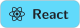

  
  

<picture>
  <source media="(max-width: 600px)" srcset="assets/terminal-narrow.svg">
  
</picture>

###  Competitions

- **Optiver AI Chessathon 2026.** 2nd of 465 teams in the qualifier as a solo entry, then 5th in the London final. [aichessathon-agent](https://github.com/xRyann2255/aichessathon-agent)
- **IMC Prosperity.** 3rd in the UK in 2024, and 4th in the UK in 2025. [imc-prosperity-2025](https://github.com/xRyann2255/imc-prosperity-2025)
- **ICHack 2024.** Best Newcomer Hack with map.it, and runner-up for Citadel's Most Innovative Use of Financial Data.
- **Apps for Good.** First place globally.

###  Languages and tools

  
  
  
  
  
  
  
  

  
  
  
  
  
  

