  
  

<picture>
  <source media="(max-width: 600px)" srcset="assets/terminal-narrow.svg">
  
</picture>

<picture>
  <source media="(max-width: 600px)" srcset="assets/competitions-narrow.svg">
  
</picture>

  
  

<picture>
  <source media="(max-width: 600px)" srcset="assets/stack-narrow.svg">
  
</picture>
